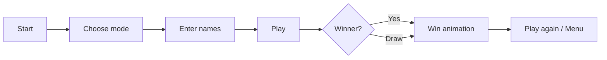

<div align="center">

# ✦ X / O ✦

**A minimal dark Tic-Tac-Toe game for macOS — built in C++ with native Cocoa**

<br/>


<br/>

```
╔══════════════════════════════════════╗
║                                      ║
║          ·   ·   ·                   ║
║                                      ║
║          ·   X   ·        dark UI    ║
║                                      ║
║          ·   ·   O        bright X/O ║
║                                      ║
╚══════════════════════════════════════╝
```

<br/>

> Click. Play. Win.  
> Two players on one laptop, or challenge a smart bot.

<br/>

<!-- Replace with your own GIF: record the app and save as docs/demo.gif -->
<!--  -->

🎬 **Demo GIF** — add `docs/demo.gif` here after recording your app

</div>

---

## ✨ Features

<table>
<tr>
<td width="50%">

### 🎮 Gameplay
- **2 Players** on one Mac — pass & play
- **Vs Bot** with minimax AI (unbeatable on perfect play)
- **Custom names** before each game
- **Score board** — last **10 games** at the top
- Win / draw detection with **animated finish**

</td>
<td width="50%">


### 🎨 Look & Feel
- **Dark blue-black** gradient background
- **Bright X** (coral) & **Bright O** (cyan) — everything else stays minimal
- **Hover preview** — ghost mark before you click
- **Place animation** — smooth scale-in when marking a cell
- **Win pulse** — winning line glows before result screen
- Soft **button strokes** & styled name inputs

</td>
</tr>
</table>

---

## 🖼️ Screens

| Menu | Name entry | Game |
|:---:|:---:|:---:|
| Centered **X / O** title | Empty fields with placeholder hints | Board centered, score on top |
| Start → choose mode | 1 name (bot) or 2 names (2P) | Turn text uses your names |

---

## 🚀 Quick Start

### Requirements
- **macOS**
- **Xcode Command Line Tools** (`clang++`)

```bash
xcode-select --install
```

### Build & Run

```bash
git clone https://github.com/YOUR_USERNAME/xoo.git
cd xoo
make
open ./xo
```

<details>
<summary><b>🖥️ Terminal tips</b></summary>

<br/>

**Keep using the terminal while the game runs:**
```bash
open ./xo
```

**Run in foreground** (terminal waits until you close the game):
```bash
./xo
```

**Do not use** `./xo ; exit` — that closes your terminal tab when the game quits.

</details>

---

## 🎯 How to Play



1. Click **Start**
2. Pick **2 Players** or **Play vs Bot**
3. Type your name(s) — fields show hints only until you write
4. Click a cell to place **X** or **O**
5. Move mouse over empty cells to **preview** your mark before clicking
6. Close the window to **quit** the app completely

---

## 🛠️ Tech Stack

| Layer | Technology |
|-------|------------|
| Language | C++98 |
| UI | Cocoa / AppKit (Objective-C++) |
| Animations | QuartzCore, custom draw loops |
| AI | Minimax algorithm |
| Build | Make + `clang++` |
| Platform | macOS native window |

---

## 📁 Project Structure

```
xoo/
├── main.mm      # Game logic, UI, animations, score history
├── Makefile     # Build rules
└── README.md    # You are here
```

---

## 🧰 Make Commands

| Command | Description |
|---------|-------------|
| `make` | Build the `xo` executable |
| `make re` | Clean rebuild |
| `make clean` | Remove object files |
| `make fclean` | Remove object files + executable |

---
</div>
